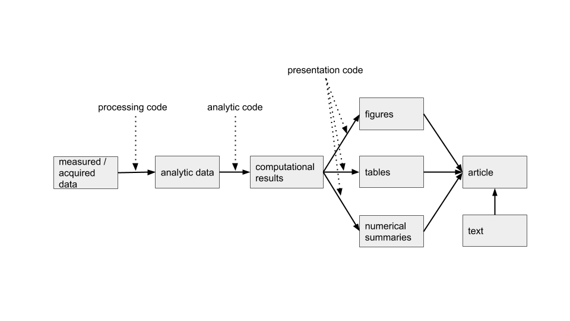
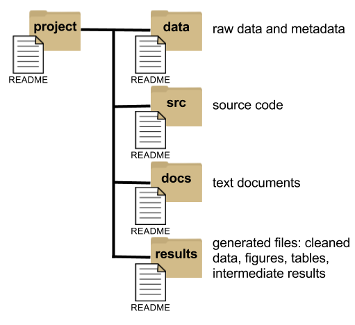
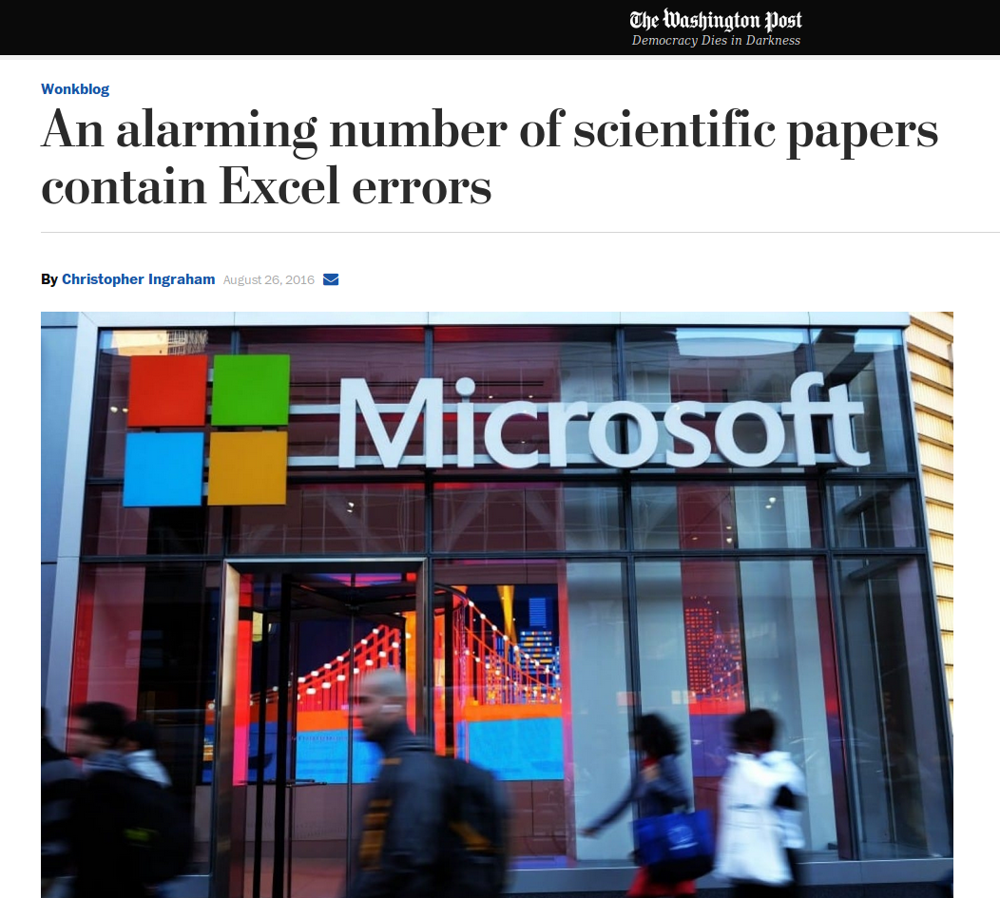
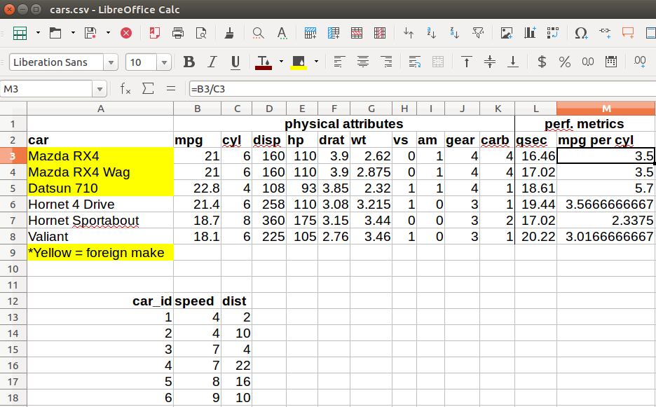

class: middle




.footnote[J. Bryan from http://stat545.com/]

???

# research workflow


---
class: middle, inverse

- what if something needs to be redone, how to you manage that

- keeping track of data sources, versions

- how did I make that figure?


???

# challenges


---
class: middle

- figure x and table x are contradictory

- redo the analyses without omitting samples

???

# committee meeting scenario


---
background-image: url(https://media.giphy.com/media/MEtSuIu6qu0HC/giphy.gif)
background-position: 50% 50%
background-size: 50%
class: inverse

<br>
<br>

.yellow[*"Basically, if the thought of redoing your analyses is terrifying then you are doing it wrong."*
— J. Bryan]

???

# you are doing it wrong


---
class: middle

.light-blue[now add to that publishing your data and code]


.footnote[
J. Bryan from http://stat545.com/
]

???

# research workflow plus


---
class: middle

**reproducible research** is the ability to recompute data analytic results, given an observed data set and knowledge of the data analysis pipeline.

.footnote[Peng 2015 [The reproducibility crisis in science: A statistical counterattack](https://doi.org/10.1111/j.1740-9713.2015.00827.x)]

???

# reproducible research


---
class: middle

**reproducibility for scientific reasons**

* increased trustworthiness
* more rigorous, reliable science
* learning more from one another's work

  
.footnote[Thompson 2018 [The Life & Times of a Reproducible Clinical Project in R](https://bit.ly/jlt-rmed2018)]

???

# reproducibility for science


---
class: middle

**reproducibility for personal reasons**

- helps researchers remember how and why they did *x*
- enables researchers to quickly and simply modify figures, tables, etc.
- enables quick reconfiguration of previously conducted research tasks

  
.footnote[Alson and Rick 2021 [A Beginner\'s Guide to Conducting Reproducible Research](https://doi.org/10.1002/bes2.1801)]

???

# reproducibility for you


---
class: middle, center

# how?


---
class: middle

- naming things
- conventions
- project organization
- metadata
- data formats
- scripting
- version control

???

# best practices


---
class: inverse

<br>

which set of file(names)s would you prefer at 3 a.m. before a deadline?

.center[
  
]

.yellow[check with your mentor as to whether your lab employs a naming convention]

.footnote[J. Bryan [Naming things](https://speakerdeck.com/jennybc/how-to-name-files)]

???

# naming things

---

.maroon[*"Your closest collaborator is you six months ago but you do not reply to emails."*
— K. Broman]

<br>

.pull-left[
  
]

.pull-right[
* all materials for a project in one directory
* organize according to a convention (e.g., R package structure)
* clear separation of data, methods, and output while making clear the relationship among them
* specify the computational environment
* convey meaning with thoughtful file and directory names
* include README files
]

.yellow[check with your mentor as to how your lab organizes files and directories]

.footnote[K. Broman [Steps toward reproducible research](bit.ly/jsm2016)]

???

# project organization


---
class: middle

.center[
comprehensive map of all countries in the world that use MMDDYYYY format

  </img>
]

<br>
  
use the ISO 8601 standard for dates (YYYY-MM-DD) everywhere. always. without exception, ever!


.footnote[J. Bryan [Naming things](https://speakerdeck.com/jennybc/how-to-name-files)]

???

# convention: ISO example


---
class: middle

* use open file formats (e.g., csv not xlsx)

<br>
<br>

.center[
  
]

.footnote[Wilson et al. 2017 [Good enough practices in scientific computing](https://doi.org/10.1371/journal.pcbi.1005510)]

???

# open file formats


---
class: middle

most basic principle for reproducible research: **do everything via code**

* downloading data from the web
* converting an Excel file to CSV
* renaming columns or variables
* omitting bad samples or data points

*...do all of these programmatically*

.footnote[Broman 2016 [Steps toward reproducible research](https://bit.ly/jsm2016)]

???

# everything by code


---
<br>
<br>
<br>

learn a language, any language, just do it

.pull-left[
  
]

.pull-right[
  
]

???

# learn a language


---
class: middle, center



.left-footnote[Ingraham 2016 [*An alarming number of scientific papers contain Excel errors*](https://www.washingtonpost.com/news/wonk/wp/2016/08/26/an-alarming-number-of-scientific-papers-contain-excel-errors/)]

???

# excel errors


---

**spreadsheets: the 2nd best tool for everything**

<br>
<br>
<br>

.pull-left[
  
]

.pull-right[

the beauty and the travesty of spreadsheets is that they allow you to do just about *anything*

* data in merged cells
* data in formatting
* small multiples
* data in formulas

]

???

# second best tool


---
class: middle

* use open file formats (e.g., csv not xlsx)

<br>
<br>

.center[
  
]

.footnote[Wilson et al. 2017 [Good enough practices in scientific computing](https://doi.org/10.1371/journal.pcbi.1005510)]

???

# open file formats

---


**spreadsheets versus scripting**

consider, we want to remove samples that we feel may have been contaminated...

.pull-left[

  **in a R script**
  <hr>
  ```r
  some work...
  ```
  

.small[*comment code:*
.light-blue[remove samples 4 and 5 that may have been compromised due to wading upstream during sampling]]
  
  ```r
  chemistry_data %>%
    filter(!sampleID %in% c(4,5))
  ```
  
  ```r
  ...more work
  ```
]

.pull-right[

  **in a spreadsheet**
  <hr>
  
  
]

???

# spreadsheets versus scripting


---
class: inverse, middle, center


???

# file chaos


---
class: middle

*it is all about taming chaos*...

.center[
  
]

.footnote[
  Bryan 2018 [*Excuse Me, Do You Have a Moment to Talk About Version Control?*](https://doi.org/10.1080/00031305.2017.1399928)
]

.yellow[check with your mentor about your lab's use of version control]

???

# tame the chaos


---
class: inverse, middle, center


???

# Vicky Boykis on Git

---
background-image: url('assets/figures/whypublish.png')
background-size: 90%

**why publish data**...

.yellow[work with your mentor to ensure that the data you contribute are made publicly available]

.footnote[Milotić 2018 [Good enough practices in data management](https://speakerdeck.com/milotictanja/good-enough-practices-in-data-management)]

???

# why publish data

* big picture
  + increasingly a requirement
  + advancement of science
  
* researcher perspective
  + papers with publicly available data receive a higher number of citations than similar studies lacking available data<sup>1</sup>
  + data sharing is associated with higher productivity
  + a citeable product
  
---

**ORCiD**

<br>

.center[
  
]

.footnote[[orcid.org](https://orcid.org/)]

???

# ORCiD